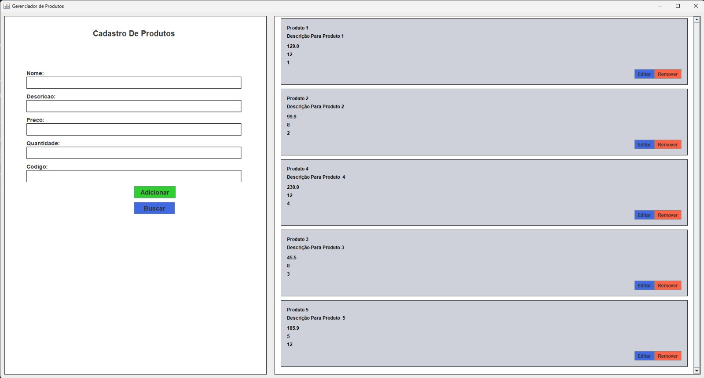

# 🛠️ Gerenciador de Produtos - CRUD em Java

Este projeto foi desenvolvido como parte da disciplina **Programação Orientada a Objetos II (POO2)**.  
Seu objetivo é criar uma aplicação desktop que permite o **gerenciamento de produtos** com as operações básicas de CRUD: **Cadastrar, Buscar, Atualizar, Listar e Deletar** produtos.

---

## 📸 Interface do Sistema



> A imagem acima representa a interface gráfica da aplicação, feita em Java Swing.

---

## ✅ Funcionalidades

- **Cadastrar Produto**: Preencha o formulário com nome, descrição, preço, quantidade e código único.
- **Buscar Produto**: Informe o código do produto e edite os dados existentes, ou delete o produto.
- **Atualizar Produto**: Altere os dados de um produto existente.
- **Listar Produtos**: Exibe todos os produtos cadastrados em forma de cards.
- **Deletar Produto**: Remove um produto selecionado permanentemente.

---

## 🧰 Tecnologias Utilizadas

- [Java 17+](https://www.oracle.com/java/)
- [Java Swing](https://docs.oracle.com/javase/tutorial/uiswing/)
- [PostgreSQL](https://www.postgresql.org/)
- [Docker Compose](https://docs.docker.com/compose/)
- [JDBC](https://docs.oracle.com/javase/8/docs/technotes/guides/jdbc/)

---

## 🐳 Banco de Dados com Docker

O projeto utiliza um container Docker para subir o banco PostgreSQL.  
Você pode iniciar com o seguinte comando:

```bash
docker-compose up -d
